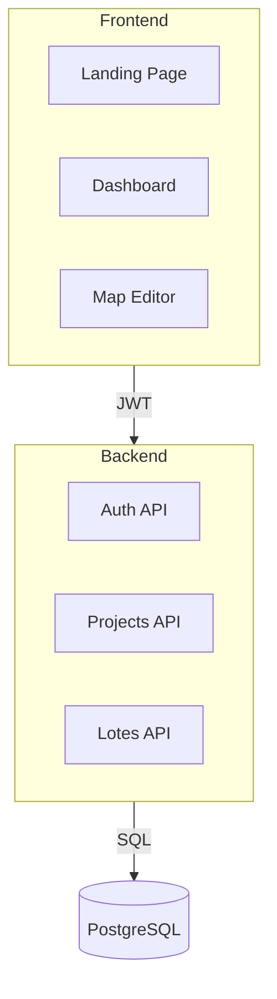

# 🧠 Jamba AI 2.1 Integration Guide

## Overview

Integração do **Jamba AI 2.1** da AI21 Labs para análise e estruturação avançada do projeto Ativo Real.

### Por que Jamba?

- ✅ **256K tokens de contexto** - Analisa projeto inteiro
- ✅ **Híbrido SSM-Transformer** - Eficiência + performance
- ✅ **Especializado em código** - Entende arquiteturas complexas
- ✅ **Latência baixa** - Respostas rápidas mesmo com contexto grande

---

## 🎯 Dual-Model Strategy

| Modelo | Uso | Contexto | Latência |
|--------|-----|----------|----------|
| **Phi-Silica 3.6** | Chat contextual rápido | ~4K tokens | ~1s |
| **Jamba AI 2.1** | Análise profunda de arquitetura | ~256K tokens | ~5s |

### Quando usar cada um?

**Phi-Silica** (já implementado):
```typescript
// Chat rápido no dashboard
"Como cadastrar uma propriedade rural?"
"O que é CAR?"
"Ajuda com o mapa"
```

**Jamba** (novo):
```python
# Análise de arquitetura completa
analyzer.analyze_project_structure(all_files, "architecture")

# Code review de PR
analyzer.code_review(git_diff, context="Feature: JWT Auth")

# Refatoração de componente
analyzer.suggest_refactoring(component_code, "component")

# Geração de diagramas
analyzer.generate_architecture_diagram(project_structure)
```

---

## 🔧 Setup

### 1. Instalar Dependência

```bash
pip install ai21==2.1.2
```

### 2. Obter API Key

1. Acesse: https://studio.ai21.com/
2. Crie conta (free tier disponível)
3. Navegue para **API Keys**
4. Copie sua key

### 3. Configurar no Azure Functions

```bash
# local.settings.json
{
  "Values": {
    "AI21_API_KEY": "sua-key-aqui",
    "JAMBA_MODEL": "jamba-1.5-large"
  }
}
```

### 4. Azure Portal (Produção)

```
Configuration → Application Settings
+ New application setting
Name: AI21_API_KEY
Value: <sua-key>
```

---

## 📚 Casos de Uso

### 1. Análise de Arquitetura Completa

```python
from jamba_analyzer import JambaStructureAnalyzer

analyzer = JambaStructureAnalyzer()

# Coletar todos arquivos do projeto
project_files = [
    {"path": "backend/models.py", "content": open("backend/models.py").read()},
    {"path": "backend/logic_services.py", "content": open("backend/logic_services.py").read()},
    {"path": "frontend/src/App.tsx", "content": open("frontend/src/App.tsx").read()},
    # ... mais arquivos
]

# Analisar
result = analyzer.analyze_project_structure(project_files, analysis_type="architecture")

print(result["analysis"])
```

**Output esperado:**
```markdown
## Análise de Arquitetura - Ativo Real

### Visão Geral
Arquitetura serverless no Azure com separação frontend/backend clara...

### Componentes Principais
1. **Backend**: Azure Functions (Python)
2. **Frontend**: React SPA (TypeScript)
3. **Database**: PostgreSQL + PostGIS

### Padrões Identificados
✅ Repository Pattern (logic_services.py)
✅ DTO Pattern (schemas.py)
⚠️ Monólito no GlobalMap (1303 linhas)

### Recomendações
1. Refatorar GlobalMap em módulos
2. Implementar CQRS para queries geoespaciais
3. ...
```

---

### 2. Code Review Automatizado

```python
# Em um webhook do GitHub/GitLab
git_diff = """
diff --git a/backend/auth_middleware.py b/backend/auth_middleware.py
new file mode 100644
index 0000000..abc123
+++ b/backend/auth_middleware.py
@@ -0,0 +1,100 @@
+def require_auth(func):
+    # implementação
"""

review = analyzer.code_review(
    diff=git_diff,
    context="Implementação de autenticação JWT"
)

# Postar review no PR
post_github_comment(review["review"])
```

---

### 3. Refatoração Inteligente

```python
# GlobalMap.tsx (1303 linhas) → Módulos menores
component_code = open("frontend/src/GlobalMap.tsx").read()

refactor = analyzer.suggest_refactoring(component_code, "component")

# Aplicar sugestões
with open("frontend/src/map/MapCore.tsx", "w") as f:
    f.write(refactor["refactored_code"])
```

---

### 4. Geração de Diagramas

```python
project_structure = {
    "backend": {
        "functions": ["auth", "projetos", "lotes", "assinaturas"],
        "models": ["User", "Projeto", "Lote", "Assinatura"],
        "integrations": ["PostgreSQL", "InfinitePay", "Azure Storage"]
    },
    "frontend": {
        "pages": ["Landing", "Login", "Dashboard", "Map"],
        "components": ["Sidebar", "MapEditor", "AIChat"],
        "state": ["AuthContext", "Zustand", "React Query"]
    }
}

diagram = analyzer.generate_architecture_diagram(project_structure)

# Salvar como Mermaid
with open("docs/architecture.mmd", "w") as f:
    f.write(diagram["diagram"])
```

**Output (Mermaid):**


---

## 🚀 Integração com Endpoints

### Endpoint: Análise de Projeto

```python
# backend/function_app.py
from jamba_analyzer import JambaStructureAnalyzer
import azure.functions as func

@app.route(route="ai/analyze-project", methods=["POST"])
@require_auth
@require_role(UserRole.ADMIN, UserRole.TOPOGRAFO)
def analyze_project(req: func.HttpRequest) -> func.HttpResponse:
    """
    Analisa arquitetura do projeto usando Jamba AI 2.1
    
    Body:
    {
      "files": [{"path": "...", "content": "..."}],
      "analysis_type": "architecture" | "security" | "performance"
    }
    """
    try:
        body = req.get_json()
        files = body.get("files", [])
        analysis_type = body.get("analysis_type", "architecture")
        
        analyzer = JambaStructureAnalyzer()
        result = analyzer.analyze_project_structure(files, analysis_type)
        
        return func.HttpResponse(
            json.dumps(result),
            status_code=200,
            mimetype="application/json"
        )
        
    except Exception as e:
        return func.HttpResponse(
            json.dumps({"error": str(e)}),
            status_code=500,
            mimetype="application/json"
        )
```

---

## 🎨 Frontend: Botão de Análise

```typescript
// frontend/src/components/AnalyzeProjectButton.tsx
import { useState } from 'react';
import { api } from '@/services/api';

export const AnalyzeProjectButton = () => {
  const [analyzing, setAnalyzing] = useState(false);
  const [result, setResult] = useState(null);

  const analyzeProject = async () => {
    setAnalyzing(true);
    
    try {
      // Coletar arquivos do projeto (via API)
      const files = await api.get('/files/project-structure');
      
      // Chamar Jamba
      const response = await api.post('/ai/analyze-project', {
        files: files.data,
        analysis_type: 'architecture'
      });
      
      setResult(response.data);
    } catch (error) {
      console.error(error);
    } finally {
      setAnalyzing(false);
    }
  };

  return (
    <div>
      <button 
        onClick={analyzeProject}
        disabled={analyzing}
        className="btn-primary"
      >
        {analyzing ? '🧠 Analisando...' : '🔍 Analisar Arquitetura'}
      </button>
      
      {result && (
        <div className="analysis-result">
          <h3>Análise Jamba AI 2.1</h3>
          <pre>{result.analysis}</pre>
        </div>
      )}
    </div>
  );
};
```

---

## 📊 Pricing & Limits

### AI21 Studio (Jamba)

| Tier | Preço | Limite Mensal | Context |
|------|-------|---------------|---------|
| **Free** | $0 | 90K tokens | 256K |
| **Basic** | $29/mês | 1M tokens | 256K |
| **Pro** | $99/mês | 5M tokens | 256K |

### Comparação com outros modelos

| Modelo | Context | Preço (1M tokens) |
|--------|---------|-------------------|
| GPT-4 Turbo | 128K | $10 |
| **Jamba 1.5** | **256K** | **$0.50** |
| Claude 3 | 200K | $15 |
| Phi-Silica | 4K | Free (Azure) |

**Jamba é 20x mais barato que GPT-4!** 🎉

---

## 🔒 Segurança

### Nunca enviar dados sensíveis

```python
# ❌ ERRADO
files = [
    {"path": ".env", "content": "DB_PASSWORD=secret123"}
]

# ✅ CORRETO
files = [
    {"path": ".env", "content": "[REDACTED]"}
]

# Use sanitização automática
def sanitize_file(file_path: str, content: str) -> str:
    sensitive_patterns = [
        r'password\s*=\s*["\'].*["\']',
        r'api_key\s*=\s*["\'].*["\']',
        r'secret\s*=\s*["\'].*["\']'
    ]
    
    for pattern in sensitive_patterns:
        content = re.sub(pattern, '[REDACTED]', content, flags=re.IGNORECASE)
    
    return content
```

---

## 🧪 Testes

```python
# tests/test_jamba_analyzer.py
import pytest
from jamba_analyzer import JambaStructureAnalyzer

def test_analyze_architecture():
    analyzer = JambaStructureAnalyzer()
    
    files = [
        {"path": "test.py", "content": "def hello(): return 'world'"}
    ]
    
    result = analyzer.analyze_project_structure(files, "architecture")
    
    assert result["success"] == True
    assert "analysis" in result
    assert result["analysis_type"] == "architecture"

def test_mock_mode_without_api_key():
    # Sem API key deve usar modo mock
    import os
    os.environ.pop("AI21_API_KEY", None)
    
    analyzer = JambaStructureAnalyzer()
    result = analyzer.analyze_project_structure([], "architecture")
    
    assert result["model"] == "mock"
```

---

## 📝 Próximos Passos

1. ✅ Instalar `ai21` package
2. ✅ Configurar `AI21_API_KEY`
3. ⏳ Criar endpoint `/ai/analyze-project`
4. ⏳ Integrar botão no dashboard
5. ⏳ Configurar webhook para code review automático

---

## 🆘 Troubleshooting

### Erro: "AI21_API_KEY not configured"

```bash
# Verificar variável
echo $AI21_API_KEY

# Configurar localmente
export AI21_API_KEY="sua-key"

# Ou no arquivo
# local.settings.json
{
  "Values": {
    "AI21_API_KEY": "sua-key"
  }
}
```

### Erro: "Context too large"

```python
# Limitar arquivos
files = files[:50]  # Apenas 50 principais

# Ou truncar conteúdo
for file in files:
    if len(file["content"]) > 5000:
        file["content"] = file["content"][:5000] + "\n... (truncated)"
```

---

## 📖 Referências

- [AI21 Studio Docs](https://docs.ai21.com/)
- [Jamba Model Card](https://www.ai21.com/jamba)
- [Python SDK](https://github.com/AI21Labs/ai21-python)
