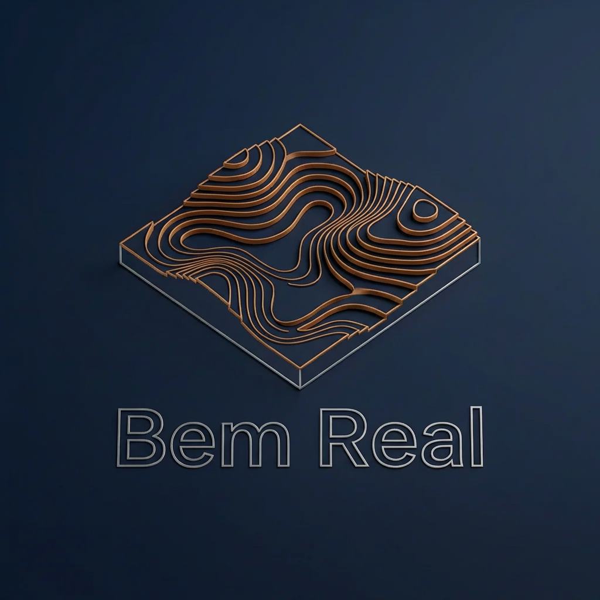

# 🎨 Guia de Estilo e Liberdade Criativa: App Bem Real

## 📋 Filosofia de Design

Este documento estabelece as **diretrizes visuais** e a **liberdade criativa** para o uso e modificação dos ativos (logos e ícones) do ecossistema Bem Real. O objetivo é manter a identidade técnica profissional enquanto permite **adaptações contextuais** para melhor UX/UI.

---

## ✅ 1. Permissão de Modificação e Ajustes

### Liberdade Total de Edição

Todos os ativos fornecidos (incluindo a logo baseada em curvas de nível 3D e os 39 ícones técnicos) são entregues em **formatos editáveis (SVG)**.

**Você e sua equipe têm permissão explícita para:**
- ✅ Ajustar dimensões e proporções
- ✅ Alterar cores para contextos específicos (dark mode, high contrast, etc.)
- ✅ Modificar espessuras de linha (stroke-width)
- ✅ Adaptar formas para melhor legibilidade
- ✅ Criar variações para diferentes estados (hover, active, disabled)
- ✅ Simplificar elementos para tamanhos pequenos
- ✅ Aplicar filtros e efeitos (blur, shadow, glow) conforme necessário
- ✅ Reorganizar elementos para layouts responsivos

### Adaptação Contextual Encorajada

Os ajustes são **encorajados** para garantir:
- 📱 **Legibilidade** em diferentes resoluções de tela (desktop, tablet, mobile)
- 🎨 **Estados de interação** (ativo, inativo, focado, desabilitado)
- ♿ **Acessibilidade** (contraste WCAG, tamanhos de toque mínimos)
- 🌙 **Modos de visualização** (light mode, dark mode, high contrast)

---

## 🎨 2. Recomendações de Identidade Visual (Não Obrigatórias)

Para manter a percepção de **"estação de trabalho de alta tecnologia"** e **precisão técnica**, sugerimos as seguintes diretrizes como ponto de partida:

### Paleta de Cores Sugerida

| Elemento | Nome da Cor | Hex Code | RGB | Aplicação Recomendada |
|----------|-------------|----------|-----|----------------------|
| **Destaque Principal** | Bronze Fosco | `#CD7F32` | rgb(205, 127, 50) | Ícones ativos, botões CTA, logos, highlights |
| **Interface/Texto** | Titânio Metálico | `#B0B0B0` | rgb(176, 176, 176) | Ícones secundários, rótulos, bordas sutis |
| **Fundo** | Azul Marinho Profundo | `#001F3F` | rgb(0, 31, 63) | Fundo principal da dashboard e mapa |

**CSS Variables (Sugestão):**
```css
:root {
  --color-primary: #CD7F32;      /* Bronze Fosco */
  --color-secondary: #B0B0B0;    /* Titânio Metálico */
  --color-background: #001F3F;   /* Azul Marinho Profundo */
  --color-accent: #E5A35C;       /* Bronze Claro (highlights) */
}
```

### Proporções e Estilo de Linha

**Recomendações para Ícones 24×24px:**
- **Peso da Linha (Stroke)**: 2px para garantir nitidez em resoluções padrão
- **Estilo de Canto**: `stroke-linejoin: round` para suavidade, ou `miter` para aspecto de engenharia
- **Caps**: `stroke-linecap: round` para terminações suaves

**Adaptações por Tamanho:**
- **16px**: Reduzir stroke para 1.5px
- **32px+**: Aumentar stroke para 2.5-3px
- **48px+**: Considerar variante com detalhes extras

### Tipografia Recomendada

| Contexto | Fonte | Peso | Tamanho | Uso |
|----------|-------|------|---------|-----|
| **Títulos** | Roboto Condensed | 700 (Bold) | 24-48px | Cabeçalhos, seções |
| **Corpo** | Roboto | 400 (Regular) | 14-16px | Textos gerais |
| **Técnico** | JetBrains Mono | 400 (Regular) | 10-14px | Coordenadas, códigos |
| **UI** | Montserrat | 300-700 | 12-18px | Botões, labels |

---

---

## 🎨 Paleta de Cores Oficial

### Cores Principais

| Nome | Hex | RGB | CMYK | Aplicação |
|------|-----|-----|------|-----------|
| **Azul Marinho Profundo** | `#001F3F` | `0, 31, 63` | `C:100 M:68 Y:0 K:75` | Fundo principal e contraste |
| **Bronze Fosco** | `#CD7F32` | `205, 127, 50` | `C:0 M:38 Y:75 K:20` | Elementos gráficos (curvas 3D) e destaque |
| **Titânio Metálico** | `#B0B0B0` | `176, 176, 176` | `C:0 M:0 Y:0 K:31` | Tipografia e elementos secundários |

### Cores Auxiliares (Variações)

| Nome | Hex | Uso |
|------|-----|-----|
| **Bronze Escuro** | `#B87333` | Sombras e profundidade |
| **Bronze Claro** | `#E5A35C` | Highlights metálicos |
| **Azul Médio** | `#002850` | Gradientes de fundo |

### Implementação CSS

```css
:root {
  /* Cores Principais */
  --azul-marinho: #001F3F;
  --bronze-fosco: #CD7F32;
  --titanio-metalico: #B0B0B0;
  
  /* Variações */
  --bronze-escuro: #B87333;
  --bronze-claro: #E5A35C;
  --azul-medio: #002850;
  
  /* Estados Interativos */
  --bronze-hover: #FFD700;
  --azul-hover: #003366;
}

.logo-container {
  background: var(--azul-marinho);
  border: 1px solid var(--bronze-fosco);
}

.logo-text {
  color: var(--titanio-metalico);
}
```

---

## 🔤 Tipografia

### Tipografia Principal (Logo)

**Fonte:** Sans-serif moderna com boa legibilidade

**Opções Recomendadas:**
1. **Montserrat** (peso 300 para "Bem", 700 para "Real")
   ```html
   <link href="https://fonts.googleapis.com/css2?family=Montserrat:wght@300;700&display=swap" rel="stylesheet">
   ```

2. **Helvetica Now** (alternativa premium)
3. **Inter** (alternativa open-source)

**Especificações:**
```css
.logo-primary {
  font-family: 'Montserrat', 'Helvetica Neue', sans-serif;
  font-size: 32px;
  font-weight: 300; /* "Bem" */
}

.logo-primary strong {
  font-weight: 700; /* "Real" */
}
```

### Tipografia Secundária (Técnica)

**Fonte:** Monospace para coordenadas, azimutes e dados numéricos

**Opções Recomendadas:**
1. **Roboto Mono** (Google Fonts)
   ```html
   <link href="https://fonts.googleapis.com/css2?family=Roboto+Mono:wght@400;700&display=swap" rel="stylesheet">
   ```

2. **JetBrains Mono** (ideal para dados técnicos)
3. **Consolas** (fallback sistema)

**Especificações:**
```css
.technical-data {
  font-family: 'Roboto Mono', 'JetBrains Mono', 'Consolas', monospace;
  font-size: 10pt;
  letter-spacing: 0.5px;
  color: #B0B0B0;
}
```

### Hierarquia Tipográfica

```css
/* Títulos */
h1 { 
  font-family: 'Montserrat', sans-serif;
  font-weight: 700;
  font-size: 32pt;
  color: #B0B0B0;
}

/* Subtítulos */
h2 { 
  font-family: 'Montserrat', sans-serif;
  font-weight: 300;
  font-size: 24pt;
  color: #CD7F32;
}

/* Corpo de Texto */
p { 
  font-family: 'Inter', 'Helvetica', sans-serif;
  font-size: 14pt;
  line-height: 1.6;
  color: #B0B0B0;
}

/* Dados Técnicos */
.coordinate, .azimuth { 
  font-family: 'Roboto Mono', monospace;
  font-size: 10pt;
  color: #CD7F32;
}
```

---

## 📂 3. Organização dos Ativos

Para facilitar a gestão e descoberta, os ícones estão organizados por **funcionalidade** e **contexto de uso**:

### Estrutura de Diretórios

```
src/assets/icons/topography/
├── 24px/                          # Ícones principais (35 itens)
│   ├── basic/                     # Navegação e Sistema
│   │   ├── ai-bot.svg             # Chatbot AI assistant
│   │   ├── clear-chat.svg         # Limpar histórico de chat
│   │   ├── send-message.svg       # Enviar mensagem
│   │   ├── close-x.svg            # Fechar/cancelar
│   │   ├── manage-panel.svg       # Painel de gerenciamento
│   │   ├── dash-projects.svg      # Dashboard de projetos
│   │   ├── dash-finance.svg       # Painel financeiro
│   │   ├── history.svg            # Histórico de ações
│   │   ├── clear-map.svg          # Limpar mapa
│   │   ├── logout.svg             # Sair do sistema
│   │   └── payment-receive.svg    # Receber pagamento
│   │
│   ├── cad/                       # Ferramentas de Desenho e Medição
│   │   ├── draw-polygon.svg       # Desenhar polígono
│   │   ├── edit-vertices.svg      # Editar vértices
│   │   ├── eraser.svg             # Apagar elemento
│   │   ├── rotate-feature.svg     # Rotacionar feature
│   │   ├── scale-feature.svg      # Escalar feature
│   │   ├── mirror-feature.svg     # Espelhar feature
│   │   ├── pan-hand.svg           # Mover mapa (pan)
│   │   ├── total-station.svg      # Estação total
│   │   ├── azimuth-arc.svg        # Arco de azimute
│   │   ├── input-xy.svg           # Input de coordenadas
│   │   ├── undo.svg               # Desfazer
│   │   └── redo.svg               # Refazer
│   │
│   ├── regulatory/                # Camadas Governamentais
│   │   ├── sigef-parcel.svg       # Parcela SIGEF
│   │   ├── incra-land.svg         # Terra INCRA
│   │   ├── car-env.svg            # CAR ambiental
│   │   ├── client-pin.svg         # Pin do cliente
│   │   ├── stats-poly.svg         # Estatísticas de polígono
│   │   ├── sync-dashboard.svg     # Sincronizar dashboard
│   │   └── save-draft.svg         # Salvar rascunho
│   │
│   └── export/                    # Exportação e Arquivos
│       ├── export-pdf.svg         # Exportar para PDF
│       ├── export-kml.svg         # Exportar para KML
│       ├── export-json.svg        # Exportar para JSON
│       ├── file-kml.svg           # Arquivo KML
│       └── file-json.svg          # Arquivo JSON
│
├── 32px/                          # Ícones CTA (3 itens)
│   ├── new-project.svg            # Novo projeto (botão grande)
│   ├── gps-center.svg             # Centralizar no GPS
│   └── ai-bot.svg                 # Chatbot (FAB button)
│
└── 16px/                          # Ícones Tiny (1 item)
    └── link-invite.svg            # Link de convite (inline)
```

### Categorias Funcionais

| Categoria | Quantidade | Descrição | Uso Principal |
|-----------|------------|-----------|---------------|
| **Basic** | 11 ícones | Navegação, chat, sistema | Interface geral, menus |
| **CAD** | 12 ícones | Desenho, medição, edição | Barra de ferramentas de desenho |
| **Regulatory** | 7 ícones | Camadas oficiais (SIGEF, INCRA, CAR) | Painel de camadas, validações |
| **Export** | 5 ícones | Exportação e arquivos | Botões de exportação, gerenciamento de arquivos |

---

## 🎨 4. Logo Oficial e Variações

### Logo Principal
<p align="center">
  
</p>

**Arquivo:** `public/logos/logo-oficial.png`  
**URL Oficial:** https://sc02.alicdn.com/kf/Aa5a72309ea704db79e2d3c1374769102B.png

**Características:**
- **Simbolismo**: Escudo topográfico com curvas de nível 3D representando elevações reais
- **Cores**: Bronze Fosco (#CD7F32) + Azul Marinho (#001F3F)
- **Efeitos**: Profundidade 3D, highlights metálicos, gradações de opacidade
- **Aspect Ratio**: 1:1 (quadrado)

### Variações Criadas (Opcionais)

Além da logo oficial, foram criadas **variações SVG** que podem ser usadas como base para adaptações:

| Arquivo | Tamanho | Descrição | Uso Sugerido |
|---------|---------|-----------|--------------|
| `logo-bemreal-completa.svg` | 256×256px | Logo completa com texto | Headers, splash screens |
| `logo-bemreal-simbolo.svg` | 128×128px | Apenas escudo topográfico | App icons, toolbars |
| `favicon-32x32.svg` | 32×32px | Simplificado (3 níveis) | Browser tabs, taskbar |
| `favicon-16x16.svg` | 16×16px | Monograma "B" | System tray, tiny icons |

**⚠️ Importante**: Estas variações SVG são **pontos de partida editáveis**. Você pode modificá-las conforme necessário para melhor adequação à interface.

---

## 📐 5. Diretrizes de Aplicação (Recomendadas)

### Área de Respiro

**Sugestão:** Mantenha um espaço mínimo de **15-20%** do tamanho do ícone/logo ao redor para garantir visibilidade.

```css
/* Exemplo de implementação */
.logo-container {
  padding: 20%;  /* Área de respiro */
}

.icon-button {
  padding: 4px;  /* 16.6% de respiro para ícone 24px */
}
```

### Fundos Recomendados

**Para Logo:**
- **Ideal**: Azul Marinho (#001F3F) - mantém identidade técnica
- **Alternativa**: Fundos escuros (< #333333) - contraste adequado
- **Aceitável**: Branco (#FFFFFF) - adicionar sombra sutil para profundidade

**Para Ícones:**
- **Ativo**: Fundo transparente com ícone Bronze (#CD7F32)
- **Inativo**: Fundo transparente com ícone Titânio (#B0B0B0)
- **Hover**: Adicionar glow ou aumentar opacity
- **Disabled**: Reduzir opacity para 40-50%

### Estados de Interação

```css
/* Exemplo de estados para ícones */
.topo-icon {
  color: #B0B0B0;              /* Inativo: Titânio */
  transition: all 0.2s ease;
}

.topo-icon:hover {
  color: #CD7F32;              /* Hover: Bronze */
  filter: drop-shadow(0 0 4px rgba(205, 127, 50, 0.6));
}

.topo-icon.active {
  color: #CD7F32;              /* Ativo: Bronze */
  font-weight: bold;
}

.topo-icon:disabled {
  color: #666666;              /* Desabilitado: Cinza escuro */
  opacity: 0.4;
  cursor: not-allowed;
}
```

---

## ♿ 6. Acessibilidade e Responsividade

### Contraste WCAG

**Validação das Cores Sugeridas:**

| Combinação | Contraste | Nível WCAG | Uso Recomendado |
|------------|-----------|------------|-----------------|
| Bronze (#CD7F32) sobre Azul Marinho (#001F3F) | **5.2:1** | ✅ AA | Ícones ativos, botões CTA |
| Titânio (#B0B0B0) sobre Azul Marinho (#001F3F) | **7.8:1** | ✅ AAA | Texto, ícones secundários |
| Branco (#FFFFFF) sobre Azul Marinho (#001F3F) | **16.5:1** | ✅ AAA | Títulos, texto principal |

**Adaptações para High Contrast Mode:**
```css
@media (prefers-contrast: high) {
  .topo-icon {
    stroke-width: 2.5px;  /* Aumentar espessura */
    color: #FFFFFF;        /* Branco puro */
  }
}
```

### Responsividade por Breakpoint

**Sugestões de Tamanhos:**

| Dispositivo | Breakpoint | Logo | Ícones UI | Ícones Toolbar |
|-------------|------------|------|-----------|----------------|
| **Desktop** | ≥1024px | 256px | 24px | 32px |
| **Tablet** | 768-1023px | 180px | 20px | 28px |
| **Mobile Large** | 480-767px | 128px | 18px | 24px |
| **Mobile Small** | <480px | 96px | 16px | 20px |

**CSS Responsivo:**
```css
.logo {
  width: clamp(96px, 15vw, 256px);  /* Escala fluida */
  height: auto;
}

.toolbar-icon {
  width: clamp(20px, 2.5vw, 32px);
  height: clamp(20px, 2.5vw, 32px);
}
```

---

## 🎭 7. Casos de Uso e Exemplos

### Landing Page
```jsx
<div style={{
  background: 'linear-gradient(135deg, #001F3F 0%, #002850 100%)',
  padding: '60px 20px'
}}>
  
</div>
```

### Header com Logo Compacta
```jsx
<header style={{ background: '#001F3F', padding: '16px' }}>
  
</header>
```

### Botão com Ícone
```jsx
<button className="toolbar-btn">
  <TopoIcon name="draw-polygon" size={24} color="#CD7F32" />
  <span>Desenhar Polígono</span>
</button>
```

### FAB (Floating Action Button)
```jsx
<button className="fab" style={{
  background: '#CD7F32',
  width: '56px',
  height: '56px',
  borderRadius: '50%',
  boxShadow: '0 4px 16px rgba(205, 127, 50, 0.4)'
}}>
  <TopoIcon name="ai-bot" size={32} color="#FFFFFF" />
</button>
```

---

## 🔧 8. Ferramentas e Workflow

### Edição de SVG

**Ferramentas Recomendadas:**
- **Figma** - Design colaborativo, exportação otimizada
- **Adobe Illustrator** - Edição profissional, precisão vetorial
- **Inkscape** - Open-source, controle total de paths
- **VS Code + SVG Extension** - Edição de código, SVGO integration

### Otimização de SVG

```bash
# Instalar SVGO
npm install -g svgo

# Otimizar ícone individual
svgo icon.svg -o icon-optimized.svg

# Otimizar pasta inteira
svgo -f src/assets/icons/topography/24px/ -o dist/icons/
```

**Configuração SVGO (svgo.config.js):**
```javascript
module.exports = {
  plugins: [
    { name: 'removeViewBox', active: false },
    { name: 'removeDimensions', active: true },
    { name: 'convertColors', params: { currentColor: true } }
  ]
}
```

### Sprite Sheet (Opcional)

Para otimizar requests HTTP, considere criar sprite sheet:

```html
<!-- sprite.svg -->
<svg xmlns="http://www.w3.org/2000/svg" style="display:none">
  <symbol id="icon-draw-polygon" viewBox="0 0 24 24">
    <!-- paths do ícone -->
  </symbol>
  <!-- mais símbolos -->
</svg>

<!-- uso -->
<svg class="icon"><use href="#icon-draw-polygon"/></svg>
```

---

## 📞 9. Suporte e Colaboração

### Dúvidas Técnicas

📧 **Email:** dev@bemreal.com.br  
📞 **Telefone:** +55 (11) 9xxxx-xxxx

### Compartilhamento de Melhorias

Se você criar **variações úteis** ou **adaptações inovadoras** dos ativos, encorajamos o compartilhamento com a equipe:

1. Documente o contexto de uso (tamanho, contraste, dispositivo)
2. Exporte em SVG otimizado
3. Envie para: assets@bemreal.com.br
4. Inclua screenshots de implementação

### Feedback de UX

Sua experiência com os ativos é valiosa! Reporte:
- ❌ **Problemas de legibilidade** em contextos específicos
- 💡 **Sugestões de novos ícones** necessários
- 🎨 **Adaptações bem-sucedidas** que podem beneficiar outros projetos

---

## 📝 10. Resumo Executivo

### ✅ O Que Você PODE Fazer

- ✅ Modificar cores para melhor contraste
- ✅ Ajustar tamanhos e proporções
- ✅ Criar variações para estados (hover, active, disabled)
- ✅ Simplificar para resoluções menores
- ✅ Aplicar filtros e efeitos
- ✅ Reorganizar elementos para layouts responsivos
- ✅ Criar versões dark/light mode
- ✅ Adaptar para acessibilidade (high contrast, motion reduced)

### 💡 O Que Recomendamos

- 💡 Usar a paleta Bronze/Titânio/Azul como base
- 💡 Manter stroke-width consistente (2px para 24px)
- 💡 Testar contraste WCAG AA mínimo (4.5:1 para texto)
- 💡 Adicionar área de respiro de 15-20%
- 💡 Documentar variações criadas para consistência
- 💡 Compartilhar melhorias com a equipe

### 🎯 Princípios Centrais

1. **UX em Primeiro Lugar**: Adapte ativos para melhor experiência do usuário
2. **Consistência Visual**: Mantenha padrões dentro do seu projeto
3. **Acessibilidade**: Garanta contraste e legibilidade adequados
4. **Performance**: Otimize SVGs antes do deploy
5. **Iteração**: Teste, ajuste e melhore continuamente

---

## 📚 Referências

- **WCAG 2.1**: https://www.w3.org/WAI/WCAG21/quickref/
- **Material Design Icons**: https://material.io/design/iconography
- **SVG Optimization**: https://github.com/svg/svgo
- **NBR 13.133**: Norma de execução de levantamento topográfico

---

<p align="center">
  <strong>Este guia prioriza sua autonomia criativa para entregar a melhor experiência ao usuário.</strong>
</p>

<p align="center">
  Desenvolvido com flexibilidade pela equipe <strong>Bem Real</strong>
</p>

```
┌────────────────────────────────┐
│  ← 20% →                       │
│          ┌──────────┐          │
│  ↑       │   LOGO   │      ↑   │
│  20%     │          │      20% │
│  ↓       └──────────┘      ↓   │
│                   ← 20% →      │
└────────────────────────────────┘
```

**Implementação CSS:**
```css
.logo-wrapper {
  padding: 20%; /* Área de respiro */
  display: inline-block;
}

/* Alternativa com cálculo */
.logo-safe-area {
  padding: calc(var(--logo-size) * 0.2);
}
```

**Exemplo:**
- Logo de 100px → Área de respiro de 20px (total: 140px)
- Logo de 256px → Área de respiro de 51px (total: 358px)

### 2. Fundo Obrigatório

**Regra:** Utilize SEMPRE o **fundo Azul Marinho (#001F3F)** original, conforme a logo oficial.

**Motivos:**
- ✅ Contraste ideal (WCAG AAA)
- ✅ Preserva efeito de profundidade 3D
- ✅ Mantém aspecto premium das luzes metálicas
- ✅ Reforça identidade visual "estação de trabalho"
- ✅ Garante reconhecimento imediato da marca

**Implementação CSS:**
```css
/* Fundo Oficial (OBRIGATÓRIO) */
.logo-container {
  background: #001F3F; /* Azul Marinho Profundo */
  padding: 20%;        /* Área de respiro */
}

/* Gradiente Sutil (Aceitável) */
.logo-bg-gradient {
  background: linear-gradient(180deg, #001F3F 0%, #002850 100%);
}
```

**❌ PROIBIDO:**
- ❌ Fundo branco ou claro (perde identidade visual)
- ❌ Fundos coloridos aleatórios (vermelho, verde, roxo, etc.)
- ❌ Fundos com baixo contraste
- ❌ Imagens de fundo com ruído visual
- ❌ Fundos transparentes (exceto para exportação técnica)

### 3. Redução de Tamanho

**RegraTamanhos Permitidos

**Regra:** Utilize a logo oficial em qualquer tamanho, respeitando a **escala proporcional** e a **área de respiro**.

**Tamanhos Recomendados:**

| Contexto | Tamanho Mínimo | Tamanho Ideal | Observações |
|----------|----------------|---------------|-------------|
| **Cabeçalho Web** | 128px | 256px | Logo completa visível |
| **App Mobile** | 64px | 128px | Logo completa ou símbolo |
| **Favicon** | 32px | 32px | ⚠️ Requer versão simplificada aprovada |
| **Impressão A4** | 300 DPI | 600 DPI | Alta resolução |
| **Banner/Outdoor** | 1024px | 2048px | Máxima qualidade |

**⚠️ IMPORTANTE para Tamanhos Pequenos (< 64px):**
- Para favicons e ícones de sistema, solicite versões simplificadas aprovadas
- Não crie variações próprias sem autorização formal
- Contato: design@bemreal.com.br
```html
<picture>
  <source media="(min-width: 128px)" srcset="logo-completa.svg">
  <source media="(min-width: 32px)" srcset="logo-simbolo.svg">
  
</picture>
```

**CSS Adaptativo:**
```css
.logo {
  width: var(--logo-size);
  height: var(--logo-size);
  background-image: url('logo-completa.svg');
}

@media (max-width: 128px) {
  .logo {
    background-image: url('logo-simbolo.svg');
  }
}

@media (max-width: 32px) {
  .logo {
    background-image: url('favicon-16x16.svg');
  }
}
```

### 4. Orientação e Alinhamento

**Regra:** A logo deve sempre estar **centralizada** ou **alinhada à esquerda** (nunca à direita).

```css
/* Centralizado (Preferencial) */
.logo-center {
  display: flex;
  justify-content: center;
  align-items: center;
}

/* Alinhado à Esquerda (Cabeçalhos) */
.logo-lChecklist de Conformidade

Antes de usar a logo, verifique:

**✅ PERMITIDO:**
- ✅ Escalar proporcionalmente (manter aspect ratio 1:1)
- ✅ Fundo Azul Marinho (#001F3F) ou gradiente sutil
- ✅ Área de respiro mínima de 20%
- ✅ Formato PNG ou SVG (alta qualidade)
- ✅ Cores originais (Bronze #CD7F32, Azul #001F3F, Titânio #B0B0B0)
- ✅ Opacidade 100% (sem transparência)
- ✅ Posicionamento centralizado ou alinhado à esquerda

**❌ PROIBIDO SEM APROVAÇÃO:**
- ❌ Qualquer alteração de cor
- ❌ Qualquer alteração de sombreamento ou efeitos 3D
- ❌ Distorções de escala (esticar/comprimir)
- ❌ Rotações  Oficial da Logo

### Logo Oficial Única

**Download da Logo Original:**
```
URL: https://sc02.alicdn.com/kf/Aa5a72309ea704db79e2d3c1374769102B.png
Formato: PNG (alta resolução)
Uso: TODOS os contextos da marca
```

**⚠️ IMPORTANTE:**
- Esta é a **ÚNICA fonte autorizada** da logo
- Não crie variações próprias
- Não exporte versões de ferramentas de design sem aprovação
- Para versões em outros formatos, solicite à equipe de design

### Arquivos de Referência (Desenvolvimento)

```
public/logos/
├── logo-oficial.png                (Download da URL oficial)
├── logo-completa-512.png           (Exportação de alta resolução)
├── logo-completa-256.png           (Uso web padrão)
└── favicon-32x32.png               (⚠️ Versão simplificada aprovada)
```

**Nota:** Os arquivos SVG gerados são apenas para referência técnica. Sempre utilize a logo oficial PNG da URL fornecida.
## 📦 Arquivos de Ativos

### Estrutura de Diretórios

```
public/logos/
├── logo-bemreal-completa.svg       (256×256px - Versão completa)
├── logo-bemreal-simbolo.svg        (128×128px - Símbolo isolado)
├── favicon-32x32.svg               (32×32px - Favicon grande)
├── favicon-16x16.svg               (16×16px - Favicon pequeno)
├── apple-touch-icon.png            (180×180px - iOS)
├── logo-completa-512.png           (512×512px - High-res)
├── logo-completa-256.png           (256×256px - Standard)
└── logo-simbolo-64.png             (64×64px - Ícones pequenos)
```

### SVG (Recomendado)

**Vantagens:**
- ✅ Escalabilidade infinita sem perda de qualidade
- ✅ Tamanho de arquivo pequeno (< 5KB)
- ✅ Editável com código (fácil customização)
- ✅ Suporta animações CSS/JS
- ✅ Otimizado para web (compressão gzip)

**Uso:**
```html
<!-- Inline SVG -->


<!-- Como background CSS -->
<style>
.header-logo {
  background-image: url('/logos/logo-bemreal-completa.svg');
  background-size: contain;
  background-repeat: no-repeat;
}
</style>
```

**Otimização SVGO:**
```bash
# Comprimir SVG
svgo --multipass --pretty --indent=2 logo.svg -o logo-optimized.svg

# Configuração .svgo.config.js
module.exports = {
  multipass: true,
  plugins: [
    'removeDoctype',
    'removeXMLProcInst',
    'removeComments',
    'removeMetadata',
    'cleanupNumericValues'
  ]
};
```

### PNG (Uso Geral)

**Vantagens:**
- ✅ Suporte universal (todos os navegadores)
- ✅ Transparência (canal alpha)
- ✅ Otimizado para raster (300 DPI para impressão)

**Especificações de Exportação:**

| Uso | Tamanho | DPI | Formato |
|-----|---------|-----|---------|
| Web Standard | 256×256px | 72 DPI | PNG-24 |
| Redes Sociais | 512×512px | 72 DPI | PNG-24 |
| Impressão Offset | 2048×2048px | 300 DPI | PNG-24 |
| Favicon | 32×32px, 16×16px | 72 DPI | PNG-8 |
| Apple Touch Icon | 180×180px | 72 DPI | PNG-24 |

**Comando ImageMagick (Exportar PNG):**
```bash
# Converter SVG para PNG (alta qualidade)
convert -density 300 -background none logo.svg -resize 512x512 logo-512.png

# Otimizar PNG (reduzir tamanho)
pngquant --quality=80-95 --speed=1 logo-512.png -o logo-512-optimized.png
```

**Uso HTML:**
```html
<!-- Favicon -->
<link rel="icon" type="image/png" sizes="32x32" href="/logos/favicon-32x32.png">
<link rel="icon" type="image/png" sizes="16x16" href="/logos/favicon-16x16.png">

<!-- Apple Touch Icon -->
<link rel="apple-touch-icon" sizes="180x180" href="/logos/apple-touch-icon.png">

<!-- Open Graph (Redes Sociais) -->
<meta property="og:image" content="https://bemreal.com.br/logos/logo-completa-512.png">
```

### Outros Formatos (Opcionais)

#### WebP (Alternativa Moderna)
```bash
# Converter PNG para WebP
cwebp -q 90 logo-512.png -o logo-512.webp
```

#### ICO (Favicon Legado)
```bash
# Criar .ico com múltiplos tamanhos
convert logo-16.png logo-32.png logo-48.png favicon.ico
```

#### PDF (Impressão Vetorial)
```bash
# Converter SVG para PDF
inkscape logo.svg --export-filename=logo.pdf
```

---

## 🎯 Casos de Uso Específicos

### 1. Cabeçalho Web

```html
<header class="app-header">
  <div class="logo-container">
    
  </div>
  <nav><!-- Menu --></nav>
</header>

<style>
.app-header {
  background: linear-gradient(180deg, #001F3F 0%, #002850 100%);
  padding: 20px;
  border-bottom: 2px solid #CD7F32;
}

.logo-container {
  display: flex;
  align-items: center;
  gap: 16px;
}

.logo-container img {
  filter: drop-shadow(0 2px 8px rgba(205, 127, 50, 0.3));
  animation: logoGlow 3s infinite;
}

@keyframes logoGlow {
  0%, 100% { filter: drop-shadow(0 2px 8px rgba(205, 127, 50, 0.3)); }
  50% { filter: drop-shadow(0 2px 12px rgba(205, 127, 50, 0.6)); }
}
</style>
```

### 2. Favicon (Browser Tab)

```html
<!DOCTYPE html>
<html>
<head>
  <!-- Favicon Moderno -->
  <link rel="icon" type="image/svg+xml" href="/logos/favicon-32x32.svg">
  
  <!-- Fallback PNG -->
  <link rel="icon" type="image/png" sizes="32x32" href="/logos/favicon-32x32.png">
  <link rel="icon" type="image/png" sizes="16x16" href="/logos/favicon-16x16.png">
  
  <!-- Apple Touch Icon -->
  <link rel="apple-touch-icon" sizes="180x180" href="/logos/apple-touch-icon.png">
  
  <!-- Manifest (PWA) -->
  <link rel="manifest" href="/site.webmanifest">
</head>
</html>
```

### 3. Loading Screen / Splash

```html
<div class="splash-screen">
  
  <div class="splash-loader"></div>
</div>

<style>
.splash-screen {
  position: fixed;
  top: 0;
  left: 0;
  width: 100vw;
  height: 100vh;
  background: #001F3F;
  display: flex;
  flex-direction: column;
  align-items: center;
  justify-content: center;
  z-index: 9999;
}

.splash-logo {
  width: 256px;
  height: 256px;
  animation: fadeInScale 1s ease-out;
}

@keyframes fadeInScale {
  from {
    opacity: 0;
    transform: scale(0.8);
  }
  to {
    opacity: 1;
    transform: scale(1);
  }
}

.splash-loader {
  width: 40px;
  height: 40px;
  border: 3px solid rgba(205, 127, 50, 0.3);
  border-top-color: #CD7F32;
  border-radius: 50%;
  animation: spin 1s linear infinite;
  margin-top: 30px;
}

@keyframes spin {
  to { transform: rotate(360deg); }
}
</style>
```

### 4. Documentos Técnicos (Relatórios)

```html
<header class="report-header">
  <div class="header-banner">
    
    <div class="report-info">
      <h1>Relatório Técnico de Topografia</h1>
      <p class="report-meta">
        <span>Projeto: Fazenda São José</span>
        <span>Data: 22/01/2026</span>
      </p>
    </div>
  </div>
</header>

<style>
.header-banner {
  background: #001F3F;
  padding: 20px;
  display: flex;
  align-items: center;
  gap: 20px;
  border-bottom: 3px solid #CD7F32;
}

.report-info h1 {
  font-family: 'Montserrat', sans-serif;
  font-size: 24pt;
  font-weight: 700;
  color: #B0B0B0;
  margin: 0;
}

.report-meta {
  font-family: 'Roboto Mono', monospace;
  font-size: 10pt;
  color: #CD7F32;
  margin-top: 8px;
}

.report-meta span {
  margin-right: 20px;
}
</style>
```

### 5. Redes Sociais (Open Graph)

```htm**Baixar logo oficial** da URL: `https://sc02.alicdn.com/kf/Aa5a72309ea704db79e2d3c1374769102B.png`
- [ ] Salvar em `/public/logos/logo-oficial.png`
- [ ] Configurar `` com caminho correto e aspect ratio preservado
- [ ] Adicionar fundo Azul Marinho (#001F3F) no container
- [ ] Validar área de respiro (20% padding em todos os lados)
- [ ] Configurar meta tags Open Graph com logo oficial
- [ ] Testar logo em diferentes resoluções (desktop, mobile, tablet)
- [ ] **NUNCA** aplicar filtros CSS que alterem cores ou efeitos
- [ ] **NUNCA** criar variações sem aprovação formal
- [ ] Documentar uso correto no README do projeto

<!-- Twitter Card -->
<meta name="twitter:card" content="summary_large_image">
<meta name="twitter:image" content="https://bemreal.com.br/logos/logo-completa-512.png">
<meta name="twitter:title" content="Bem Real - Geoprocessamento">
```

---

## ✅ C**Utilizar APENAS** a logo oficial da URL fornecida
- [ ] **NUNCA** criar variações sem aprovação formal
- [ ] Documentar grid de construção (baseado na logo original)
- [ ] Criar mockups com a logo oficial (não recriar)
- [ ] Preparar templates com fundo Azul Marinho (#001F3F)
- [ ] Testar legibilidade em diferentes contextos (com logo original)
- [ ] Validar contraste WCAG 2.1 (Bronze sobre Azul = 5.2:1 ✓ AA)
- [ ] Solicitar aprovação formal para qualquer adaptação necessária180px)
- [ ] Configurar meta tags Open Graph com logo 512×512px
- [ ] Testar logo em modo claro/escuro do navegador
- [ ] Validar área de respiro (20% padding)
- [ ] Implementar versão responsiva (completa → símbolo → monograma)

### Para Designers
- [ ] Exportar logo em SVG vetorial (Illustrator/Figma)
- [ ] Criar variações: completa, símbolo, monograma
- [ ] Gerar PNGs em 300 DPI para impressão
- [ ] Documentar grid de construção e proporções
- [ ] Criar manual de marca (PDF com todas as regras)
- [ ] Preparar versões para fundos claros (com adaptação)
- [ ] Testar legibilidade em mockups físicos (cartões, banners)
- [ ] Validar contraste WCAG 2.1 (AA mínimo)

### Pa**Baixar logo oficial** e distribuir via drive corporativo
- [ ] **Compartilhar URL oficial** com parceiros e fornecedores
- [ ] Preparar templates para redes sociais (usando logo oficial)
- [ ] **Documentar usos proibidos** (distorções, cores incorretas, variações)
- [ ] Registrar marca no INPI (proteção legal)
- [ ] Criar guia rápido de 1 página (PDF) com link para logo oficial
- [ ] **Monitorar uso correto** em todos os canais
- [ ] **Reportar usos não autorizados** para equipe de design
- [ ] Distribuir assets para equipe (Google Drive/Figma)

---

## 📊 Métricas de Qualidade

### Contraste (WCAG 2.1)
```
Bronze (#CD7F32) sobre Marinho (#001F3F): 5.2:1 ✓ AA
Titânio (#B0B0B0) sobre Marinho (#001F3F): 7.8:1 ✓ AAA
```

### Tamanhos de Arquivo
```
logo-completa.svg:     4.2 KB (otimizado)
logo-simbolo.svg:      2.8 KB (otimizado)
favicon-32x32.svg:     1.5 KB (otimizado)
logo-completa-512.png: 45 KB (PNG-24, otimizado)
```

### Performance Web
```
Formato SVG: ✅ Recomendado (escalável, leve)
Lazy Loading: ✅ Aplicar em logos abaixo do fold
CDN: ✅ Hospedar em CDN para cache global
```

---

## 📚 Referências e Recursos

### Ferramentas Recomendadas
- **Design:** [Figma](https://figma.com), [Adobe Illustrator](https://adobe.com/illustrator)
- **Otimização SVG:** [SVGOMG](https://jakearchibald.github.io/svgomg/), [SVGO CLI](https://github.com/svg/svgo)
- **Otimização PNG:** [TinyPNG](https://tinypng.com/), [ImageOptim](https://imageoptim.com/)
- **Favicon Generator:** [RealFaviconGenerator](https://realfavicongenerator.net/)
- **Contraste:** [WebAIM Contrast Checker](https://webaim.org/resources/contrastchecker/)

### Padrões Seguidos
- [Material Design - Logo Guidelines](https://material.io/design/communication/imagery.html)
- [Apple HIG - App Icons](https://developer.apple.com/design/human-interface-guidelines/app-icons)
- [WCAG 2.1 - Contrast Requirements](https://www.w3.org/WAI/WCAG21/Understanding/contrast-minimum.html)

---

**Versão:** 1.0.0  
**Última atualização:** 22 de Janeiro de 2026  
**Responsável:** Equipe de Design Bem Real  
**Próxima revisão:** Trimestral (Abril/2026)

---� Penalidades por Uso Indevido

O uso da logo Bem Real em desacordo com estas diretrizes pode resultar em:
- ⚠️ Solicitação formal de correção imediata
- 🚫 Suspensão de acesso a materiais da marca
- ⚖️ Ação legal em casos de danos à imagem da marca

**A integridade da marca é responsabilidade de todos.**

---

## 📞 Suporte e Aprovações

**Dúvidas sobre uso da logo:**  
📧 design@bemreal.com.br  
📞 +55 (11) 9xxxx-xxxx

**Solicitação de adaptações especiais:**  
Enviar email com:
- Contexto de uso detalhado
- Mockups/exemplos visuais
- Justificativa técnica da necessidade
- Prazo de resposta: 3-5 dias úteis

**Download da logo oficial:**  
🔗 https://sc02.alicdn.com/kf/Aa5a72309ea704db79e2d3c1374769102B.png

**Denúncia de uso indevido:**  
📧 compliance@bemreal.com.br
**Solicitação de formatos adicionais:**  
Abrir ticket no sistema interno ou enviar email para equipe de design.
